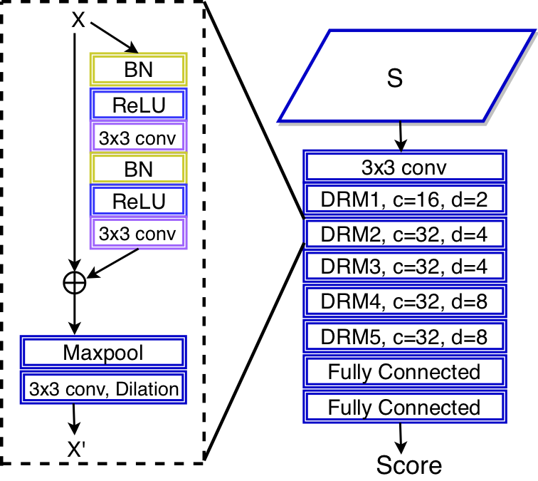
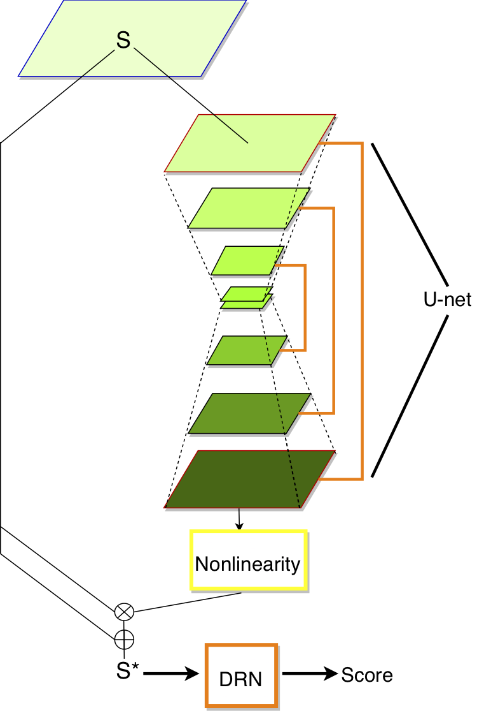

# Attentive Filtering Network
This repository contains codes to reproduce the core results from our ICASSP 2019 paper: 
* [Attentive Filtering Networks for Audio Replay Attack Detection](https://arxiv.org/abs/1810.13048)
 
If you find the code useful, please cite
```
@inproceedings{lai2018attentive,
  title={Attentive Filtering Networks for Audio Replay Attack Detection},
  author={Lai, Cheng-I and Abad, Alberto and Richmond, Korin and Yamagishi, Junichi and Dehak, Najim and King, Simon},
  booktitle={2019 IEEE International Conference on Acoustics, Speech and Signal Processing (ICASSP)},
  year={2019},
  organization={IEEE}
}
```

## Abstract 
An attacker may use a variety of techniques to fool an automatic speaker verification system into accepting them as a genuine user. Anti-spoofing methods meanwhile aim to make the system robust against such attacks. The ASVspoof 2017 Challenge focused specifically on replay attacks, with the intention of measuring the limits of replay attack detection as well as developing countermeasures8.pdf against them. In this work, we propose our replay attacks detection system - Attentive Filtering Network, which is composed of an attention-based filtering mechanism that enhances feature representations in both the frequency and time domains, and a ResNet-based classifier. We show that the network enables us to visualize the automatically acquired feature representations that are helpful for spoofing detection. Attentive Filtering Network attains an evaluation EER of 8.99% on the ASVspoof 2017 Version 2.0 dataset. With system fusion, our best system further obtains a 30% relative improvement over the ASVspoof 2017 enhanced baseline system.

.
.



## Visualization of attention heatmaps with different non-linearities
sigmoid


tanh


softmaxF (softmax on feature dimension)


softmaxT (softmax on time dimension)


# Dependencies
This project uses Python 2.7. Before running the code, you have to install

## Getting Started
1. Download the [ASVspoof 2017 Dataset](http://www.asvspoof.org/index2017.html)
2. run.sh contains examples of training the networks on GPU 
3. main.py contains detials of the training details and configurations
4. src/attention_neuro/simple_attention_network.py contains the implementation of Attentive Filtering Network.

## Authors 
Cheng-I Lai, [Alberto Abad](https://www.l2f.inesc-id.pt/w/Alberto_Abad_Gareta), Korin Richmond, [Junichi Yamagishi](https://nii-yamagishilab.github.io), Najim Dehak, [Simon King](http://homepages.inf.ed.ac.uk/simonk/)

## Contact 
Cheng-I Jeff Lai: jefflai108@gmail.com
